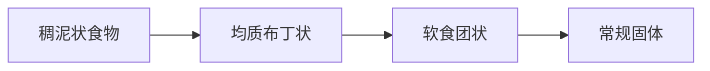

# 个性化康复治疗计划方案

## 1. 康复目标
**短期目标（1-4周）**：
- 预防误吸性肺炎及营养不良
- 恢复基础吞咽反射（咽反射/咳嗽反射）
- 实现安全吞咽唾液（Rosenbek分级降至≤3级）
- 提升舌喉复合体上抬幅度（喉上抬≥1.5横指）
- 改善进食能力（FOIS提升至3级：单一性状食物经口进食）

**长期目标（3-6个月）**：
- 实现安全经口进食常规食物（FOIS≥5级）
- 消除误吸风险（Rosenbek分级≤1级）
- 恢复自主进食能力（EAT-10≤10分）
- 拔除鼻饲管
- 改善口颜面对称性及运动功能

## 2. 治疗方法
### （1）吞咽功能训练
- **感觉刺激训练**  
  - 冰酸刺激：冰棉棒刺激腭弓、舌根、咽后壁（每日4次，餐前进行）
  - 气脉冲刺激：喉镜导管脉冲刺激梨状窝（每日2次）
- **运动功能训练**  
  - 舌抗阻训练：压舌板分级抵抗舌上抬/侧推（每日3组×10次）
  - Masako训练：舌前伸时吞咽（每日3组×5次）
  - Shaker训练：仰卧抬头看脚（每日3组×1分钟）
  - 声门上吞咽法：吞咽前屏气→吞咽→咳嗽（每餐前5次）
- **神经肌肉电刺激**  
  - VitalStim治疗仪：电极片放置于舌骨-甲状软骨区（30Hz，每日1次×20分钟）

### （2）代偿策略
- **进食姿势**  
  - 坐位低头吞咽（下颌内收≥30°）
  - 进食后保持低头位30秒
- **食物性状调整**  
  - 阶段性食物递进：  

  - 初期采用增稠剂调制至IDDSI 4级（浓泥状）

### （3）呼吸功能训练
- 腹式呼吸训练（每日4组×10次）
- 声门下咳训练：深吸气→屏气→用力咳嗽（每小时5次）
- 呼气肌训练：阈值负荷呼吸训练器（初始负荷20cmH₂O，每日2组×10次）

### （4）营养管理
- 鼻饲配方：高蛋白匀浆膳（1250kcal/d，蛋白质≥1.5g/kg）
- 每次注食前回抽胃液监测pH值
- 口腔清洁护理（每日4次）

### （5）心理干预
- 吞咽焦虑认知行为疗法（每周3次）
- 放松训练：渐进性肌肉放松（每日2次×15分钟）

### （6）风险预警方案
| 风险因素         | 干预措施                     | 监测频率       |
|------------------|------------------------------|----------------|
| 误吸性肺炎       | 血氧监测+肺部听诊            | 每4小时        |
| 营养不良         | 每周体重+前白蛋白检测        | 每周           |
| 脱水             | 尿比重监测+皮肤弹性评估       | 每日           |
| 情绪障碍恶化     | GAD-7量表筛查                | 每周2次        |

> **治疗进度调整原则**：  
> - 每3日进行VFSS床边简化版评估（3mL稠糊试验）  
> - Rosenbek分级≥4级时暂停经口进食训练  
> - 喉上抬幅度未达1.5横指时强化Shaker训练强度