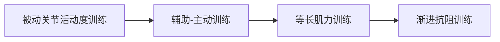

# 个性化康复治疗计划方案

## 1. 康复目标
**短期目标（1-4周）**：
- 维持现存关节活动度，预防肌肉挛缩及深静脉血栓
- 改善呼吸功能，目标血氧饱和度≥95%（静息状态）
- 提升基础ADL能力，实现床上自主翻身
- 缓解双手感觉减退症状，预防皮肤损伤
- 控制疲乏程度（BFI评分降至60分以下）

**长期目标（3-6个月）**：
- 恢复辅助下坐位平衡能力（30分钟）
- 实现床椅转移及如厕部分自理（MBI≥45分）
- 肌力提升1-2级（左上肢远端达II级，双下肢达IV级）
- 建立适应性运动模式，满足基础居家活动需求
- 心理状态改善（PHQ-9降至轻度抑郁范围）

## 2. 治疗方法

### 一、运动疗法

- **每日2次**：  
  - 上肢：肩肘腕关节PROM训练（重点左侧），肩袖肌群等长收缩（5秒/次×10组）  
  - 下肢：踝泵训练（20次/小时），髋膝关节PROM训练  
- **强度控制**：  
  - 心率≤100次/分，SpO₂≥90%，Borg评分≤3分  
  - 贫血未纠正前禁用抗阻训练  

### 二、呼吸康复
- **膈肌激活训练**：  
  - 腹式呼吸（5分钟/次，4次/日），吸气肌训练仪（初始负荷≤30% MIP）  
- **气道廓清技术**：  
  - 体位引流（根据肺部感染部位）+ 徒手叩击（避开骨髓抑制区域）  

### 三、作业治疗
- **上肢功能重建**：  
  - 感觉再教育（冰/毛刷刺激尺侧手掌）  
  - 适应性ADL训练：使用长柄辅具完成面部清洁  
- **疲劳管理**：  
  - 能量节省技术：活动分段化（≤10分钟/次），配合坐位支撑架  

### 四、物理因子治疗
| 干预部位      | 治疗方式              | 参数设置             | 频次      |
|---------------|-----------------------|----------------------|-----------|
| 双手关节      | 蜡疗                  | 42-45℃, 20分钟       | 1次/日    |
| 双下肢肌肉    | 低频电刺激            | 感觉阈上，20Hz       | 2次/日    |
| 全身          | 紫外线血液照射        | 按血液科方案执行     | 遵医嘱    |

### 五、营养与代谢管理
- **蛋白质补充**：  
  - 1.5g/kg/d优质蛋白（约67.5g/d），分6次给予  
- **电解质监控**：  
  - 训练前血清钾≥3.5mmol/L，钙≥2.1mmol/L  

### 六、心理社会干预
- **认知行为疗法**：  
  - 每日15分钟病友群成功案例讨论  
  - 睡眠卫生教育（固定起床时间）  
- **家庭参与计划**：  
  - 家属学习安全转移技术（1对1教学）  

### 安全警示
```diff
! 绝对禁忌：
- 血红蛋白<30g/L时暂停所有主动训练
- 体温>37.5℃时终止治疗
- 血小板<50×10⁹/L避免关节挤压
```
```diff
+ 疗效监测指标：
* 每周：握力测试、SpO₂动态、BFI评分
* 每2周：MBI评估、PHQ-9筛查
``` 

> 注：本方案需与血液科、感染科每日联合会诊，根据血常规（重点关注Hb、PLT）、炎症指标（CRP、PCT）及电解质结果动态调整。