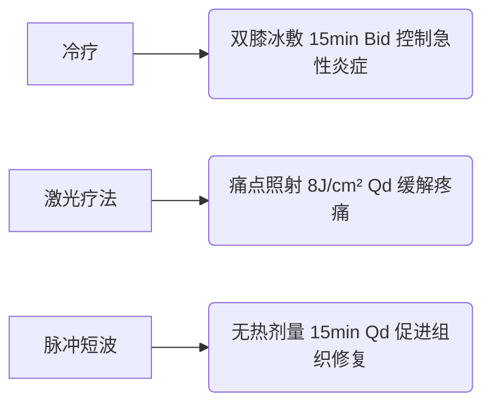

# 双膝骨关节炎康复治疗计划方案

## 1. 康复目标
**短期目标（4周内）：**
- 减轻双膝肿胀及疼痛（VAS评分降至≤4分）
- 改善关节活动度（ROM达到0°~130°）
- 恢复独立完成7层楼梯上下（ADL楼梯项恢复至10分）
- 缓解焦虑情绪（HAMA评分下降≥30%）

**长期目标（12周内）：**
- 恢复无痛日常生活能力（ADL维持≥95分）
- 重建膝关节稳定性（伸膝肌力达5级）
- 恢复规律游泳训练（每周≥3次，每次30分钟）
- 延缓关节退变进展（K-L分级维持2级）

## 2. 治疗方法
### 物理因子治疗

### 运动疗法
**关节活动训练：**
- 仰卧位滑墙训练（0°~100°渐进） 5min Bid
- 坐位无负重屈伸膝（0°~120°范围）10次×3组 Qd

**肌力强化：**
- 股四头肌等长收缩（10s保持/10s放松）20次 Qid
- 直腿抬高训练（末端维持5s）15次×3组 Bid
- 腘绳肌离心训练（俯卧位慢速屈膝）10次×2组 Qd

**功能训练：**
- 阶梯适应性训练（5cm→10cm阶梯）5min Bid
- 靠墙静蹲（30°屈膝位维持）30s×5次 Qd
- 水中步行训练（利用浮力减负）20min 隔日

### 疼痛管理
- 治疗性超声（1.0W/cm²脉冲式）内侧关节隙 5min Qd
- 经皮神经电刺激（100Hz）痛点周围 20min Bid
- 关节松动术（Maitland I-II级）髌骨松动 5min Qd

### 辅助干预
1. **教育干预：**
   - 膝关节保护原则培训（避免跪蹲/久站）
   - 楼梯使用技巧（健侧先上/患侧先下）
   - 家用冷敷方案指导（疼痛发作时立即冰敷）

2. **环境改造：**
   - 推荐使用带扶手坐便器
   - 楼梯间安装双侧扶手
   - 备折叠椅应对电梯故障

3. **心理干预：**
   - 渐进式肌肉放松训练 10min Bid
   - 疼痛认知行为疗法 每周2次

### 注意事项
- 禁忌：深蹲、跑步机训练、负重爬坡
- 训练后疼痛持续>2小时需调整强度
- 每周复查浮髌试验及关节肿胀度
- 游泳水温需≥28℃（避免低温刺激）
