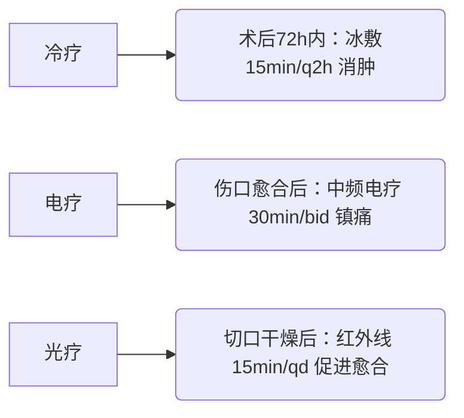

# 个性化康复治疗计划方案

## 1. 康复目标
**短期目标 (术后1-4周):**
- 控制疼痛：VAS评分降至≤4分
- 减轻右下肢肿胀，促进切口愈合
- 维持右膝关节被动活动度≥90°
- 恢复踝关节被动背屈至0°
- 预防下肢深静脉血栓及肺部感染
- ADL评分提升至≥60分（辅助下完成转移/如厕）
- 焦虑/抑郁量表评分降低≥20%

**长期目标 (术后3-6个月):**
- 恢复右下肢肌力：股四头肌≥4级，胫前肌≥4级
- 恢复右膝/踝关节全范围主动活动度
- 独立完成ADL（Barthel指数≥95分）
- 恢复无辅助器具步行能力（步态对称性＞90%）
- 重返社会角色（工作/家庭职责）
- 肺功能恢复至术前基线水平

## 2. 治疗方法
### (1) 物理因子治疗（术后24小时启动）

### (2) 运动疗法
**阶段Ⅰ (术后1-7天)：**
- 呼吸训练：膈肌呼吸法 10min/qid（目标：MIP恢复至-50mmH₂O）
- 床上运动：  
  - 健侧肢体抗阻训练（弹力带 3组×15次）  
  - 患肢踝泵训练（每小时10次）  
  - 股四头肌等长收缩（10s保持×20次/q2h）
- 关节活动：  
  - CPM机辅助膝关节训练（0°-60°开始，每日增加5°）  
  - 治疗师辅助踝关节被动背屈（-15°→0°渐进）

**阶段Ⅱ (术后2-4周)：**
- 肌力训练：  
  - 直腿抬高训练（3组×10次）  
  - 腘绳肌离心收缩（俯卧位屈膝 3组×12次）
- 负重进阶：  
  - 双拐三点步态训练（患肢触地负重≤15kg）  
  - 重心转移训练（平衡仪监测 10min/bid）

### (3) 疼痛管理
- 药物配合：NSAIDs按时给药（非甾体抗炎药）
- 体位疗法：患肢抬高20°（高于心脏水平）
- 放松训练：渐进式肌肉放松 2次/日

### (4) 心理干预
- 认知行为疗法：每日30分钟（聚焦灾难化思维矫正）
- 正念减压训练：指导音频每日1次
- 康复目标可视化：制定阶段进步图表

### (5) 生活能力重建
- 转移训练：术后3天开始床椅转移（治疗师保护）
- 穿衣/如厕适应性训练：长柄辅助器具应用
- 家居环境改造评估（出具改造建议书）

### (6) 呼吸功能强化
- 激励式肺量计训练：目标容量≥术前80%（每日8组）
- 胸廓扩张运动：坐位肋间肌牵拉 5min/tid

---
**治疗频率：**  
- 床边治疗：每日1次（45分钟）  
- 治疗大厅：术后2周起 每日2次  
- 家庭训练：按小时段分解执行（发放图文手册）  

**安全警示：**  
❗ 禁止患肢主动负重（直至X线确认骨痂形成）  
❗ 踝背屈训练时避免胫骨前向剪切力  
❗ 密切监测切口渗液及皮温变化  
