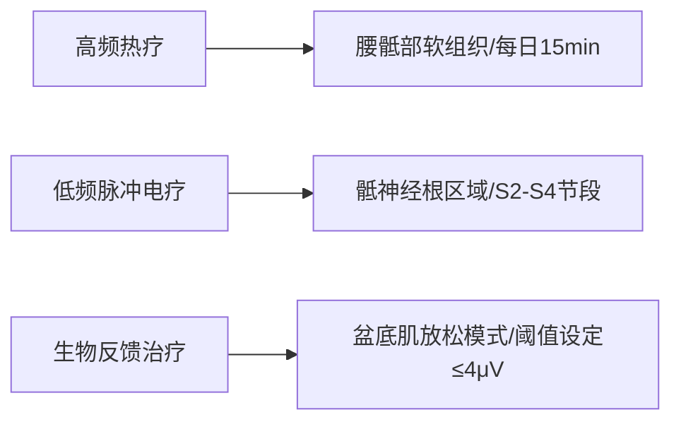

# 个性化康复治疗计划方案

## 1. 康复目标
**短期目标 (4-6周):**
- 降低盆底肌张力至正常范围（前静息阶段肌电值≤4μV）
- 缓解腰骶与会阴部疼痛（VAS评分降至≤3分）
- 提高基础盆底肌力至牛津分级≥3级
- 建立正确盆底肌-核心协同收缩模式
- 实现咳嗽时盆底反射性收缩（PERFECT中T项达标）

**长期目标 (12-16周):**
- 恢复功能性盆底肌力（牛津分级≥4级，PERFECT中P≥3级）
- 消除体位转换疼痛（站立/坐立屈曲试验转阴）
- 提升盆底耐力至持续收缩≥10秒（PERFECT中E≥5级）
- 重建膀胱支撑功能（超声显示膀胱膨出改善≥1度）
- 建立独立居家训练能力并维持疗效

## 2. 治疗方法
### (1) 物理因子治疗

### (2) 手法治疗
- **筋膜松解术**  
  - 靶点：闭孔内肌/尾骨肌扳机点（每次按压≤90秒）  
  - 频次：隔日1次，配合呼吸引导  
- **骨盆关节松动术**  
  - 技术：骶髂关节前-后滑动手法（Grade II）  
  - 注意：避开L4/5脱出节段  
- **神经动力学技术**  
  - 骶神经滑动术（针对S2-S5反射异常）  

### (3) 运动治疗
**阶段Ⅰ (0-4周)**

| 训练模块       | 具体方案                          | 监控指标               |
|----------------|-----------------------------------|------------------------|
| 盆底肌再教育   | 仰卧位离心收缩训练，5s放松/10s保持 | 肌电反馈值≤6μV        |
| 呼吸-核心整合  | 膈肌呼吸联合腹横肌激活，10次/组   | 观察协同收缩（C项改善）|
| 腰椎保护训练   | 麦肯基卧位伸展，避免屈曲负荷      | Downing试验转阴       |

**阶段Ⅱ (4-12周)**
- 进阶盆底训练：坐姿快速收缩（PERFECT中F项≥8次）  
- 功能性整合：桥式运动+盆底同步收缩（检测抬举感）  
- 动态稳定训练：鸟狗式变体（核心-盆底-臀肌链激活）  

### (4) 行为干预
- **膀胱管理**  
  - 排尿间隔≥2.5小时（减少膀胱颈活动度）  
  - 排尿体位：双肘支撑膝部（避免Valsalva）  
- **体位教育**  
  - 坐姿：使用楔形气垫（30°髋屈曲）  
  - 站立：交替足踏10cm台阶（缓解腰骶压力）  

### (5) 疼痛管理
- **神经脱敏技术**  
  - 会阴区感觉再教育（棉棒梯度刺激）  
- **疼痛日记监测**  
  - 记录疼痛与体位/活动的量化关系（VAS动态图）  

> **注意事项**  
> 1. 所有训练避开经期及排卵期（卵巢囊肿监测）  
> 2. 腰椎训练负荷≤体重的20%（MRI显示L4/5脱出）  
> 3. 禁止仰卧起坐/深蹲等增加腹压动作（子宫脱垂II度）  
