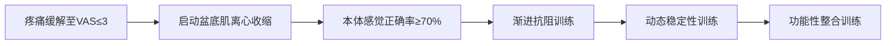

# 个性化康复治疗计划方案

## 1. 康复目标
**短期目标（4周内）**：
- 降低盆腔疼痛强度（VAS评分从6分降至≤3分）
- 改善排尿功能（日排尿频率降至≤8次，单次尿量≥200mL）
- 减轻排便困难（排便频率降至1-2次/日，消除便不尽感）
- 恢复基础盆底肌主动收缩能力（牛津肌力提升至1级）
- 提升本体感觉辨识准确率（九宫格测试正确率提高50%）

**长期目标（12周内）**：
- 消除压力性尿失禁（咳嗽/打喷嚏无漏尿）
- 恢复骨盆力学平衡（纠正长短腿及髂嵴不对称）
- 重建正常盆底肌功能（牛津肌力达3级，独立完成分级收缩）
- 恢复髋关节活动度（直腿抬高≥80°，跟臀试验阴性）
- 建立自主神经调控能力（大小便功能恢复正常）

## 2. 治疗方法
### 疼痛管理与炎症控制
- **物理因子治疗**  
  ▫️ 无热超短波（骶前区，15min/次）：缓解深层肌肉痉挛  
  ▫️ 低频脉冲磁疗（腰骶部，20min/次）：改善局部循环  
  ▫️ 冷敷（肛周暗沉区，10min Bid）：减轻组织充血  

- **手法干预**  
  ▫️ 内脏松动术：重点松解子宫韧带及膀胱直肠反折  
  ▫️ 神经动力学松解：靶向闭孔神经/阴部神经卡压点  
  ▫️ 尾骨手法复位：针对MRI提示的尾骨嵌顿  

### 盆底功能重建
- **本体感觉训练**  
  ▫️ 九宫格感觉再教育：棉签冷热交替刺激（5区→8区→2区优先）  
  ▫️ 生物反馈训练：压力探头可视化引导收缩（0.5Hz低频启动）  

- **肌张力调控**  
  ▫️ 肛提肌筋膜松解：针对条索状高张区域行横向弹拨  
  ▫️ 闭孔内肌能量技术：结合呼吸进行等长收缩-放松  

### 运动疗法
- **呼吸-核心协同训练**  
  ▫️ 膈肌分离呼吸：仰卧位肋弓扩张练习（10次×3组）  
  ▫️ 腹横肌激活：在呼气末维持腹压10秒（避免Valsalva动作）  

- **骨盆动力学矫正**  
  ▫️ 骶髂关节自复位：侧卧位髂前旋矫正（左侧重点）  
  ▫️ 髋关节松动：针对旋外受限行CAP动态关节松动  

### 结构支持与行为管理
- **骨盆稳定支持**  
  ▫️ 定制骨盆带：右侧髂嵴下加压，左侧坐骨结节承托  
  ▫️ 体位管理：坐位使用尾骨减压垫，避免前倾坐姿  

- **膀胱直肠再训练**  
  ▫️ 定时排尿计划：初始间隔2小时，逐步延长至4小时  
  ▫️ 排便体位优化：脚踏凳保持髋关节屈曲>90°  

### 进阶性训练

### 治疗频次与监测
- 急性期（1-2周）：每日1次（手法+物理因子）  
- 功能期（3-4周）：隔日1次（生物反馈+运动训练）  
- 每周评估：VAS评分/排尿日记/九宫格测试/髋关节ROM  
- 4周复查：动态盆底超声+表面肌电评估  

