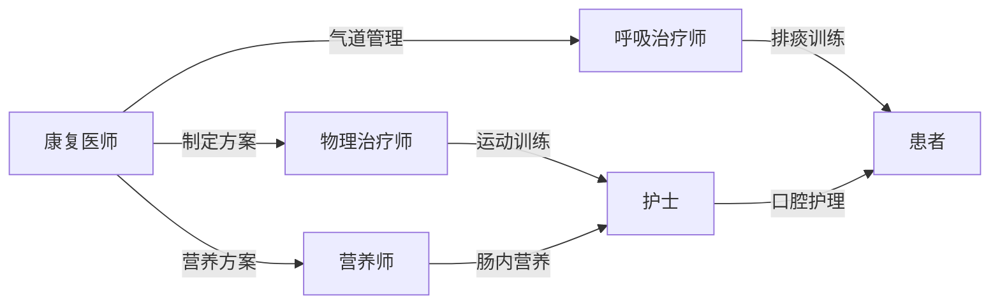

# 个性化康复治疗计划方案

## 1. 康复目标
### **短期目标（2-4周）：**
- 维持气管切开套管安全，逐步提升气道廓清能力
- 预防吞咽相关肺炎，建立安全营养支持途径
- 改善胸廓活动度，膈肌移动度提升至≥1.2cm
- 维持关节活动范围，预防废用综合征
- 控制流涎，启动口腔感觉运动训练
- 营养状态改善：BMI提升至≥17.5

### **长期目标（3-6月）：**
- 拔除气管切开套管，恢复自主呼吸功能
- 实现安全经口进食（FOIS≥4级）
- 独立完成床-椅转移
- 辅助下步行能力（Holden步行分级≥2级）
- BMI恢复至≥18.5
- 基本生活活动部分自理（Barthel指数≥40分）

## 2. 治疗方法
### Ⅰ. 呼吸康复
1. **气道管理**  
   - 每日4次振动排痰+体位引流（头低15°右侧卧位）  
   - 雾化治疗（布地奈德2mg+乙酰半胱氨酸3ml bid）  
   - 气囊压力监测（维持20-25cmH₂O）  
   - 说话瓣膜适应性训练（30min/次，2次/日）

2. **呼吸肌训练**  
   - 膈肌激活训练：手法膈肌推压+吸气阻力训练（初始0.5kPa，5min/组，3组/日）  
   - 腹式呼吸训练（10min/次，Q2h）  
   - 胸廓扩张训练：肋间肌拉伸+上肢助力呼吸运动  

### Ⅱ. 吞咽康复
1. **间接训练**  
   - 口颜面功能训练：冰酸刺激（舌根/软腭）、唇阻力训练（压舌板抗阻）  
   - Shaker训练（抬头训练 3min/次，间隔1min，3组/次）  
   - 神经肌肉电刺激（VitalStim，电极放置舌骨-甲状软骨区，强度耐受量）  

2. **直接摄食管理**  
   - 经鼻饲管营养支持（能量2000kcal/d，蛋白1.5g/kg）  
   - 染料测试阴性前禁止经口进食  
   - 吞咽姿势训练：仰头30°咽部残留清除训练  

### Ⅲ. 运动功能康复
1. **床边训练**  
   - 良肢位摆放（肩关节外展30°，髋关节防外旋）  
   - 关节活动度训练（被动→辅助，20min/次，bid）  
   - 桥式运动（辅助骨盆上抬，10个/组，2组/日）  

2. **平衡训练**  
   - 床边坐位平衡（三级渐进，初始支持面>50%）  
   - 重心转移训练（矢状面>额状面）  

### Ⅳ. 营养支持方案
- 高蛋白肠内营养制剂（渗透压300mOsm/L）  
- 分6次鼻饲（每次≤250ml）  
- 每日监测胃残留量（阈值200ml）  
- 口腔护理（氯己定冲洗 tid）  

### Ⅴ. 多学科协作

### Ⅵ. 风险监控
- 血氧饱和度监测（活动时维持≥92%）  
- 误吸风险预警（床边备吸引装置）  
- 血压控制（晨起/训练前监测，维持<140/90mmHg）  
- 炎症指标追踪（CRP+白细胞隔日检测）  
