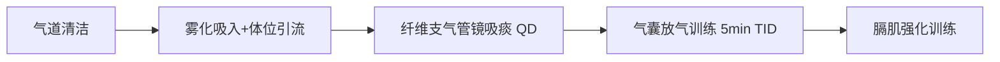
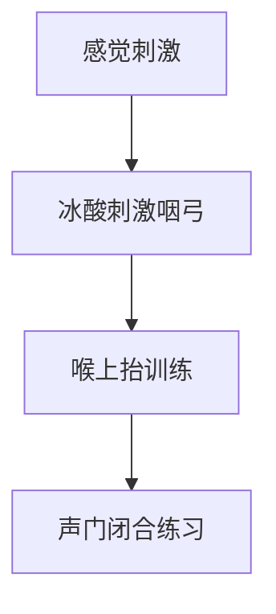

```markdown
# 康复治疗计划方案

## 1. 康复目标
### 短期目标（1-2周内）
- **呼吸功能**：  
  - 维持血氧饱和度 ≥92%  
  - 减少痰量至 Murray 分级 ≤1级  
  - 提升膈肌移动度（用力呼吸时 ≥25mm）
- **吞咽功能**：  
  - 降低误吸风险（PAS ≤5级）  
  - 改善喉上抬幅度（≥2cm）  
  - 建立安全口腔分泌物管理能力
- **营养状态**：  
  - 白蛋白提升至 ≥32g/L  
  - 停止体重下降趋势
- **并发症防控**：  
  - 控制肺部感染（痰培养转阴）  
  - 预防气管狭窄进展

### 长期目标（4-8周内）
- **功能恢复**：  
  - 拔除气管套管（满足拔管指征）  
  - 实现安全经口进食（洼田饮水试验 ≤3级）  
  - 恢复功能性言语交流能力  
- **营养重建**：  
  - 体重恢复至发病前水平（≥65kg）  
  - SMI 提升至 ≥8.5kg/m²  
- **生活能力**：  
  - ADL 达到轻度依赖状态（Barthel指数 ≥60分）

---

## 2. 治疗方法
### 呼吸康复方案

- **机械通气管理**：  
  - 维持气囊压力 25-30cmH₂O，声门下吸引 Q2H  
  - 逐步过渡到说话瓣膜使用（每日累计 ≤30min）  
- **呼吸训练**：  
  - 腹式呼吸训练（10min QID）  
  - 抗阻呼气训练（5cmH₂O压力阈值，5组×10次）  
  - 吸气肌训练（初始负荷30% MIP，5min BID）  

### 吞咽功能康复

- **器械干预**：  
  - 表面肌电生物反馈（sEMG）引导喉上抬训练  
  - 导管球囊扩张术（环咽肌失弛缓症干预，从6号导管起始）  
- **功能训练**：  
  - Shaker 训练（等长/等张头抬升，3组/日）  
  - Masako 手法（舌固定吞咽，5组×10次）  
  - 声带内收训练（用力推压+发 /a/ 音）  
- **进食管理**：  
  - **严格禁经口进食**（当前PAS=7级）  
  - 吞咽造影指导下启动3号糊状食物试喂（≤3mL/次）  

### 营养支持方案
- **肠内营养**：  
  - 高蛋白短肽配方（1.5kcal/mL）  
  - 持续泵注 80mL/h × 18h（1440kcal/d）  
  - 额外添加支链氨基酸（10g/d）  
- **监测调整**：  
  - 每日监测胃残余量（阈值 ≤200mL）  
  - 每周检测前白蛋白（目标 ≥150mg/L）  

### 并发症防控措施
- **肺部感染控制**：  
  - 体位管理：30°半卧位（除治疗时间外）  
  - 振动排痰仪 + 高频胸壁振荡（20min QID）  
- **气管狭窄预防**：  
  - 套管位置监测（颈部CT随访）  
  - 避免套管过度移动  

### 多学科协作要点
- **每日联合查房**：康复医师 + 呼吸科 + 营养科  
- **紧急干预指征**：  
  - SpO₂ 持续 <90% 且痰液堵塞  
  - 突发呼吸困难伴喘鸣音（气管狭窄警报）  
```

> **执行原则**：所有治疗需在脉氧监测下进行，血氧饱和度 <90% 时立即中止训练；吞咽训练前需确保痰液清除；营养方案随白蛋白水平动态调整。