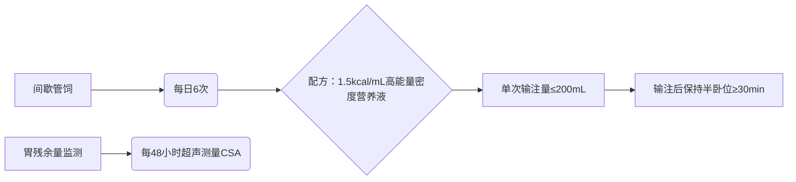
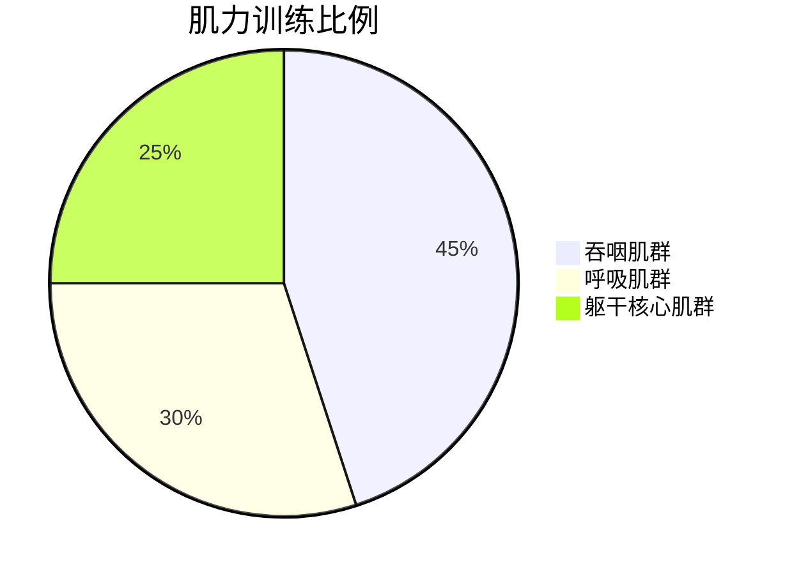

```markdown
# 脑出血后肌少症性吞咽障碍康复治疗计划方案

## 1. 康复目标
### 短期目标（4周内）
- **营养目标**  
  - 通过个体化营养支持，将白蛋白提升至≥32g/L，前白蛋白≥120mg/L  
  - BMI由15.6提升至≥16.5  
  - 每日经管饲摄入能量≥1500kcal  
- **吞咽安全目标**  
  - 洼田饮水试验改善至4级  
  - PAS误吸分级降至≤6级（中稠食物）  
  - 消除进食中稠食物时的显性误吸  
- **功能目标**  
  - 舌骨上肌群sEMG波幅提升20%  
  - 喉上抬幅度增加至≥2.5cm  
  - 最长发音时间延长至≥6秒  

### 长期目标（12周内）
- 实现完全经口进食（FOIS分级≥5级）  
- 体重恢复至≥45kg（BMI≥18）  
- 握力提升至≥18kg（女性标准）  
- MMSE评分改善至≥24分  
- 消除胃管依赖  

## 2. 治疗方法
### Ⅰ 营养管理方案


### Ⅱ 吞咽功能训练
**口咽期专项训练**  
| 训练内容              | 参数设置                  | 频次       |
|-----------------------|---------------------------|------------|
| 舌抗阻训练            | 压舌板渐进加压至3kg力     | 5min×3组/日|
| Masako训练            | 持续发/i:/音维持5秒       | 10次×3组/日|
| Shaker训练            | 仰卧抬头看脚趾保持1min    | 3次×5组/日 |
| 冰酸刺激              | 冰棉签刺激腭弓+喉上抬诱发 | 每餐前实施 |
| 声门闭合训练          | 用力握拳发/ɑ/音           | 15次×3组/日|

**进食代偿策略**  
- **体位**：躯干前倾30°+头旋转至健侧（右转）  
- **食物质地**：2号泥状食物（稠蜂蜜状）  
- **单口容量**：3mL金属勺定量喂食  
- **清除残留**：每口进食后重复空吞咽3次+左右转头吞咽  

### Ⅲ 肌肉功能重建

- **抗阻训练**：弹力带抗阻颈屈曲（起始强度黄色弹力带）  
- **神经肌肉电刺激**：VitalStim双通道电极放置方案  
  - 通道1：舌骨上肌群（下颌-舌骨连线）  
  - 通道2：甲状舌骨肌（甲状软骨上缘-舌骨连线）  
  - 参数：80Hz，300μs，通断比5：10，30min/次  

### Ⅳ 呼吸-吞咽协调训练
1. **咳嗽功能增强**  
   - 主动咳嗽训练：双手加压下腹部增加腹压  
   - 呼吸肌训练：阈值负荷吸气训练器（起始负荷15cmH₂O）  
2. **呼吸-吞咽节律**  
   - 吸气→屏气→吞咽→咳嗽序列训练  
   - 利用节拍器控制吞咽间隔≥30秒  

### Ⅴ 认知-吞咽整合训练
- **双重任务训练**：进食同时完成简单指令（如指认餐具）  
- **时间定向训练**：使用吞咽日记记录进食时间/食物类型  
- **注意力训练**：利用视觉提示卡引导进食流程  

### Ⅵ 风险防控措施
- **误吸预防**  
  - 进食后30min内持续心电监护SpO₂  
  - 床边备负压吸引装置（负压≥150mmHg）  
- **营养监测**  
  - 每日记录出入量（目标负平衡≤300mL）  
  - 每周测量上臂肌围（目标≥17.5cm）  
- **并发症预防**  
  - 口腔护理q4h（pH5.5碳酸氢钠溶液）  
  - 进食后保持半卧位≥45min  
```

