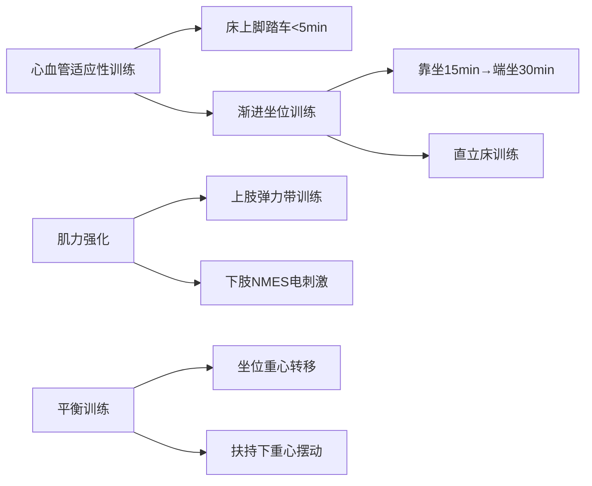
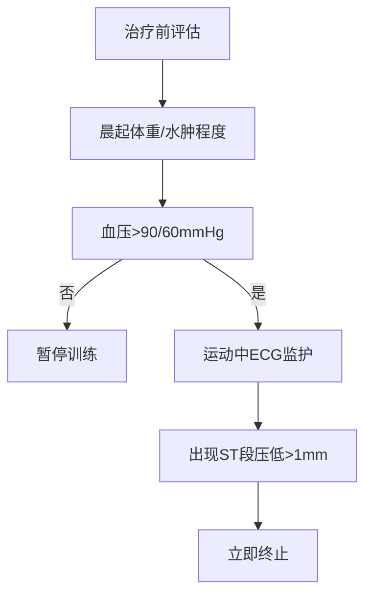

### 个性化康复治疗计划方案

#### 1. 康复目标
**短期目标（4周内）：**
- 预防深静脉血栓及关节挛缩
- 维持现存关节活动度（ROM），改善近端肌力至3级（上肢）及3-级（下肢）
- 实现辅助下床椅转移（最小辅助水平）
- 坐位耐力提升至30分钟，站立平衡达3级（可单手扶持站立）
- ADL评分提升至55分（轻度依赖），独立完成部分穿衣/如厕
- 控制静息心率≤100次/分，体位性心率增幅≤20%

**长期目标（12周内）：**
- 独立完成室内5米步行（助行器辅助）
- 肌力恢复至近端4级（上肢）/3+级（下肢），MRC-SS≥50分
- ADL评分≥70分（基本自理），独立完成床椅转移及如厕
- Berg平衡量表≥36分（低跌倒风险）
- 实现家庭环境内轮椅-工作台转换（职业需求适配）
- 营养指标稳定（白蛋白≥40g/L，Hb≥100g/L）

#### 2. 治疗方法
**A. 物理治疗（每日1次，30分钟）**

- **强度控制**：靶心率≤（220-36）×40%=74次/分（静息心率+20%）
- **进阶标准**：Borg自觉劳累量表≤3级，血氧饱和度≥92%

**B. 作业治疗（每日1次，20分钟）**
- **能量节省技术**：剪辑工作模拟（坐姿分段操作）
- **ADL再训练**：适应性辅具应用（穿衣棒、坐便器增高架）
- **环境改造**：轮椅高度适配剪辑工作台

**C. 心肺康复（每周5次）**
- 腹式呼吸训练（4s吸/6s呼）
- 阈值负荷吸气肌训练（初始负荷30% MIP）
- 间歇性低强度上肢有氧（2min运动/1min休息）

**D. 营养支持**
- 高蛋白补充：1.5g/kg/d（分6餐）+ 支链氨基酸
- 铁剂静脉输注（目标Hb≥100g/L）
- 钠盐控制：<3g/d（兼顾低钠血症与心衰）

**E. 监测与风险管控**

- **禁忌症**：D-二聚体>1mg/L时暂停下肢训练
- **营养风险干预**：每周监测前白蛋白及转铁蛋白

**F. 多学科协作**
- 肾内科：肌酐清除率指导液体摄入（目标eGFR≥45ml/min）
- 血液科：维持Hb>90g/L（输血阈值）
- 心理科：移植后抑郁筛查（PHQ-9量表）
