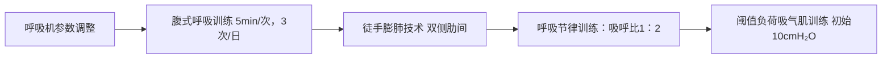
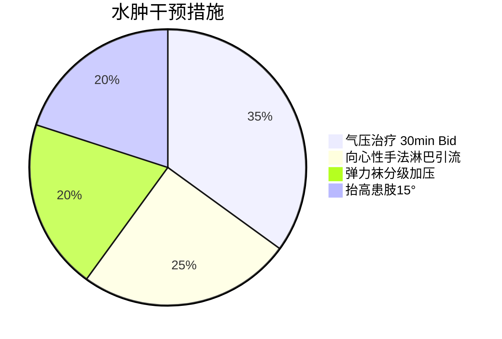

### 心脏移植术后早期康复治疗计划方案

#### 1. 康复目标
**短期目标（1-2周）：**
- 维持呼吸功能稳定，逐步脱离呼吸机辅助
- 预防深静脉血栓、压疮及关节挛缩
- 改善肢体近端肌力至≥2+级（MRC）
- 实现床上自主翻身及床边坐位维持5分钟
- 控制下肢水肿（小腿围度减少≤10%）

**长期目标（4-8周）：**
- 实现完全自主呼吸（呼吸频率<24次/分）
- 独立完成床椅转移及站立训练
- 上肢肌力≥3级，下肢肌力≥2+级（MRC）
- 改良Barthel指数提升至≥45分（部分依赖）
- 实现辅助下步行5米

#### 2. 治疗方法
**Ⅰ 呼吸康复**


**Ⅱ 运动治疗**
- **床上运动**  
  - 被动关节活动度训练（PROM）：  
    - 肩/髋关节多轴向活动 10次/轴向，2次/日  
    - 注意避开起搏器植入区域  
  - 助力肌力训练：  
    - 弹力带辅助屈髋（2级→2+级） 5次/组×3组  
    - 滑板辅助下肢滑动训练  

- **坐位训练**  
  - 渐进式摇高床头（30°→60°→90°）  
  - 床边悬垂坐位平衡训练 3min/次（心电监护下）  

**Ⅲ 循环管理**


**Ⅳ 营养与代谢支持**
- 肠内营养方案：  
  ```python
  if 便潜血阴性：
      启用低渗营养液（1.0kcal/ml）  
      起始速率20ml/h，每日递增10ml  
  else：
      暂停胃肠营养，启用TPN支持
  ```

**Ⅴ 功能重建**
- 神经肌肉电刺激（NMES）：  
  | 靶肌群   | 参数设置         | 频次      |
  |----------|------------------|-----------|
  | 股四头肌 | 30Hz, 250μs, ON:OFF=5:10s | 20min Bid |
  | 胫前肌   | 20Hz, 200μs      | 15min Bid |

- 认知训练：  
  - 定向力训练（人物/时间/地点） 3次/日  
  - 两步指令执行训练（如“抬手-眨眼”）  

**Ⅵ 监测与预警**
1. 训练强度控制标准：  
   - 心率≤静息状态+20次/分  
   - 血氧饱和度≥95%  
   - 收缩压波动≤20mmHg  
2. 暂停康复指征：  
   - 新发血便或血红蛋白下降>10g/L  
   - 肌酐增幅≥基础值50%  
   - 出现Ⅲ度房室传导阻滞  

---
### 关键治疗依据
1. **肌力训练强度**：基于MRC总分26分（>24分但<48分），选择助力训练而非抗阻训练  
2. **呼吸训练设计**：针对胸廓活动度仅2.2cm且呼吸浅快（36次/分）  
3. **水肿管理优先级**：下肢围度差>1cm（右侧小腿24.5cm vs 左侧23.5cm）  
4. **神经监测必要性**：FOUR评分8分（满分16分）提示存在意识波动风险  
