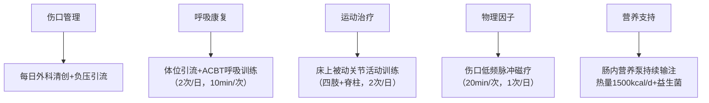
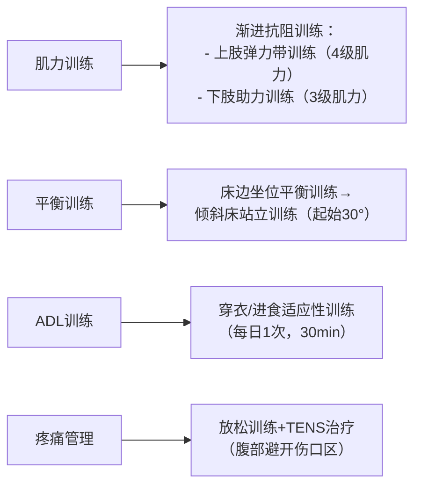

### 康复治疗计划方案

#### 1. 康复目标
**短期目标（1-2周内）：**
- 控制感染进展，降低体温至正常范围（<37℃）
- 减轻腹部疼痛（VAS降至≤3分）
- 维持现有关节活动度，预防肌肉萎缩
- 建立床上基础生活能力（自主翻身、坐位平衡达1级）
- 改善营养状态（肠内营养支持达标）

**长期目标（4-8周内）：**
- 促进腹壁缺损愈合（分泌物减少50%）
- 恢复辅助下站立能力（立位平衡达1级）
- 提高左下肢肌力至4级
- 实现床边转移及如厕部分自理（MBI提高至≥45分）
- 缓解焦虑抑郁状态（HAMA/HAMD评分下降≥30%）

#### 2. 治疗方法
**第一阶段：急性感染控制期（1-2周）**


**第二阶段：功能重建期（3-6周）**


**第三阶段：心理社会干预（全程）**
- **情绪管理**  
  └─ 药物干预联合放松意象训练（2次/日）  
  └─ 家属参与式心理疏导（每周3次）  
- **睡眠干预**  
  └─ 睡眠限制疗法（22：00-6：00）  
  └─ 白间光照暴露（每日30min）  

**治疗参数调整原则：**
- 体温>38℃暂停所有主动训练
- 血压>160/90mmHg时降低训练强度
- 伤口渗液增加时优先清创
- 训练后VAS上升>2分需减量

```diff
! 治疗警示：
+ 禁止任何腹部加压动作
+ 站立训练需心电监护
+ 肌力训练避开左侧病理征阳性肢体
```
